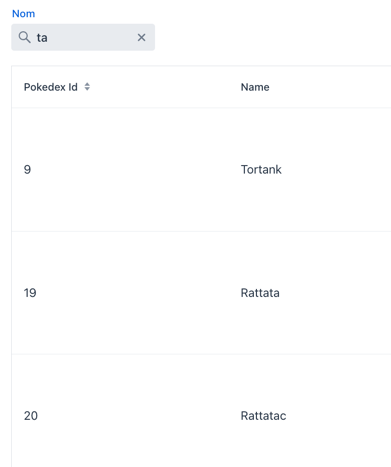

# Pokedex
This is a web application built using Spring Boot and Vaadin. 
It provides a Pokedex, a comprehensive guide to all Pokemon species.

## Features

| Feature         | Description                                                                                                                                                                                                                                                                                                                               |                                                                                                                                          |
|-----------------|-------------------------------------------------------------------------------------------------------------------------------------------------------------------------------------------------------------------------------------------------------------------------------------------------------------------------------------------|------------------------------------------------------------------------------------------------------------------------------------------|
| Generation view	| <ul><li>Display pokemon information in grid</li></li><li>Filtering by generation</li><li>Filtering by name</li><li>Number of element in the grid</li><li>Go to details view</li></ul> 	                                                                                                                                                   |  	                  |
| Details view    | <ul><li>Display selected pokemon information</li><li>Display selected pokemon sprite<ol><li>Classic form (regular / shiny)</li><li>Regional form (regular / shiny)</li></ol></li><li>Display evolution steps<ol><li>Pre evolution</li><li>Next evolution</li><li>Mega evolution</li></ol></li><li>Display Gigamax form if exist</li></ul> |     |

## Built With
* [Spring Boot](https://spring.io/projects/spring-boot) - Backend framework
* [Vaadin](https://vaadin.com/) - Web framework for building modern user interfaces

## Continuous Integration
The project uses GitHub Actions for continuous integration and deployment. Every push to the repository will trigger a build and a test.

## Author
ErwanLT
* Github: [@ErwanLT](https://github.com/ErwanLT)
* X: [ErwanLeTutour](https://twitter.com/ErwanLeTutour)
* LinkedIn : [Erwan LE TUTOUR](https://www.linkedin.com/in/erwan-le-tutour/)

## Show your support
Give a ⭐️ if this project helped you!
